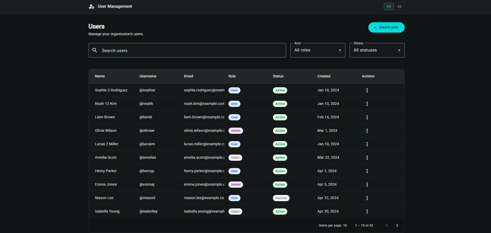
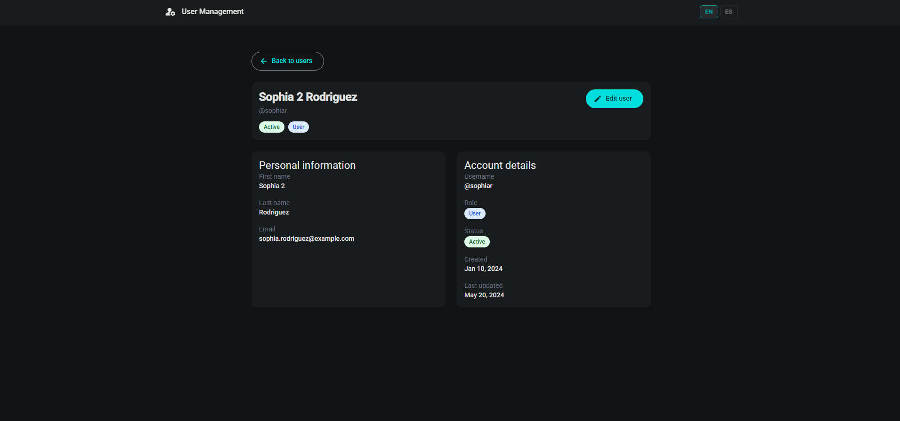
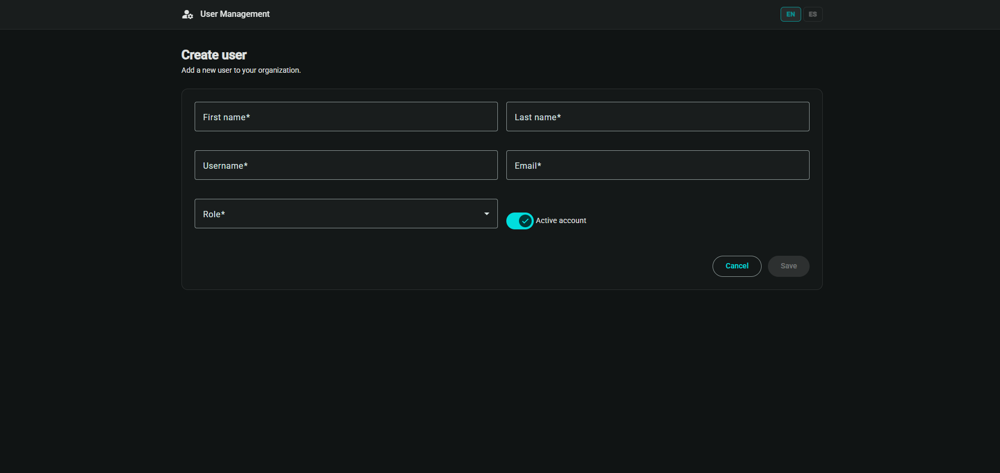
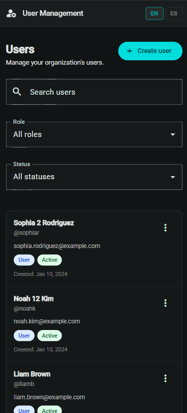

# LATAM User Management Challenge

A user management application built with Angular 21, Angular Material, Tailwind CSS v4, Signals and a mock REST API powered by json-server.

## Features

- User listing with pagination
- User search and filtering
- User detail view
- User creation
- User editing
- User activation/deactivation
- User deletion
- Responsive design for desktop and mobile
- Loading states and error handling
- Angular Material UI
- Feature-based architecture
- Standalone Components
- OnPush Change Detection
- Functional HTTP Interceptor

---

# Tech Stack

- Angular 21
- TypeScript 5.9
- Angular Material 21
- Tailwind CSS v4
- RxJS
- Angular Signals
- json-server v1
- Vitest

---

# Installation

Clone the repository:

```bash
git clone https://github.com/antonio9520/latam-user-management
cd latam-user-management
```

Install dependencies:

```bash
npm install
```

---

# Running Locally

Start the mock API:

```bash
npm run mock:api
```

The API will be available at:

```text
http://localhost:3001
```

Start the Angular application:

```bash
npm start
```

Or run both services simultaneously:

```bash
npm run start:dev
```

Application URL:

```text
http://localhost:4200
```

---

# Production Build

Generate a production build:

```bash
npm run build
```

The generated files will be available in:

```text
dist/
```

---

# API Used

This project uses a local mock REST API powered by json-server v1.

Database source:

```text
mock-api/db.json
```

Base URL:

```text
http://localhost:3001
```

Supported operations:

- GET
- POST
- PATCH
- DELETE

Pagination is handled through json-server query parameters:

```text
?_page=1&_per_page=10
```

---

# API Configuration

API configuration is centralized through the Angular environment configuration.

File:

```text
src/environments/environment.ts
```

Example:

```ts
export const environment = {
  apiBaseUrl: 'http://localhost:3001',
};
```

All requests are routed through a functional HTTP interceptor that automatically prepends the configured base URL.

---

# Screenshots

## User List



## User Detail



## User Form



## Mobile View



---

# View ↔ Endpoint Mapping

| View            | Angular Route     | Method      | Endpoint                         |
| --------------- | ----------------- | ----------- | -------------------------------- |
| Users List      | `/users`          | GET         | `/users?_page=X&_per_page=X`     |
| User Search     | `/users?search=`  | GET         | `/users` (client-side filtering) |
| User Detail     | `/users/:id`      | GET         | `/users/:id`                     |
| Create User     | `/users/new`      | POST        | `/users`                         |
| Edit User       | `/users/:id/edit` | GET + PATCH | `/users/:id`                     |
| Activate User   | Table Action      | PATCH       | `/users/:id`                     |
| Deactivate User | Table Action      | PATCH       | `/users/:id`                     |
| Delete User     | Table Action      | DELETE      | `/users/:id`                     |

---

# Project Structure

```text
src/
├── app/
│   ├── core/
│   ├── features/
│   │   └── users/
│   ├── shared/
│   └── app.routes.ts
├── assets/
├── environments/
└── main.ts
```

The application follows a feature-based architecture where all user-related functionality is grouped inside the `users` feature.

---

# Architectural Decisions

- Standalone Components instead of NgModules
- Angular Signals for local state management
- OnPush Change Detection across components
- Feature-based folder organization
- Functional HTTP Interceptors
- Angular Material as UI component library
- Tailwind CSS for utility-first styling

---

# Known Limitations / Technical Debt

## Internationalization (i18n)

An initial ngx-translate integration was prepared, including:

- Translation assets (`en.json`, `es.json`)
- Language switcher UI
- Translation service configuration

However, translation key resolution is currently not functioning as expected. Due to challenge time constraints, the feature was left as future technical debt while preserving the integration groundwork for future completion.

---

# Author

Abraham Vidal

Frontend Developer
